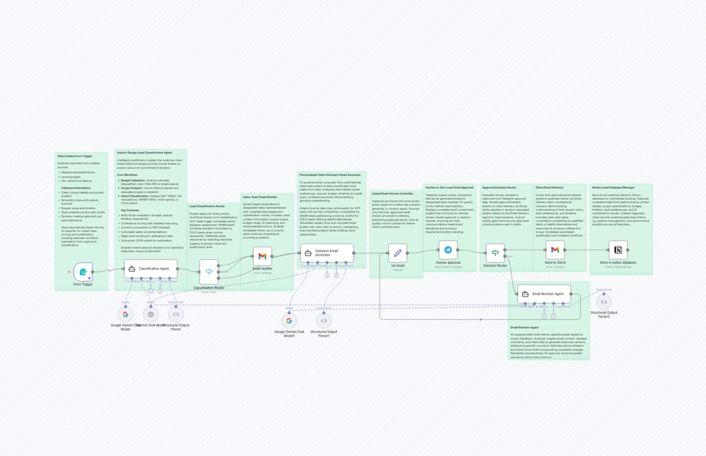
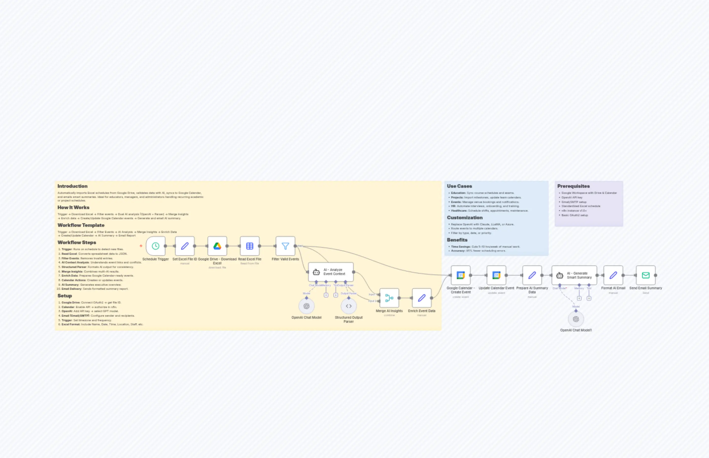
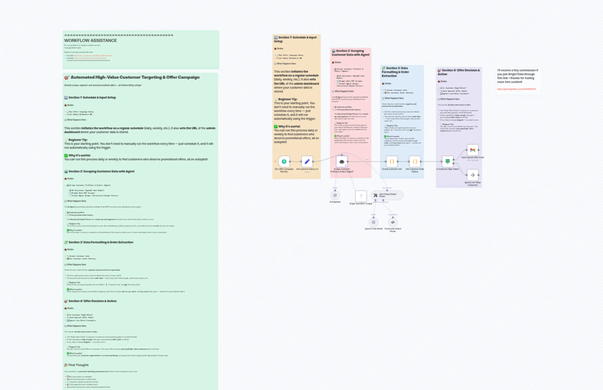
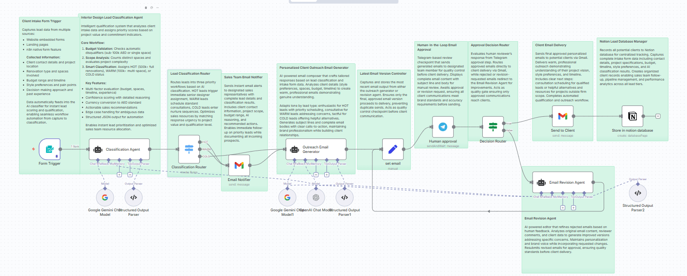
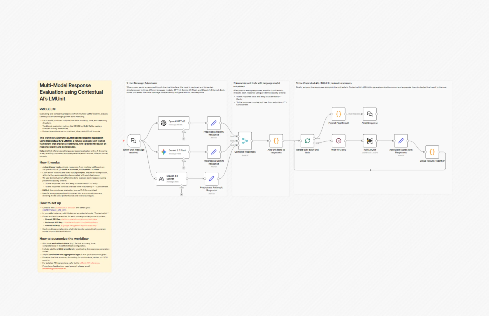

# Compare GPT-4, Claude & Gemini Responses with Contextual AI's LMUnit Evaluation

Advanced n8n automation for Compare GPT-4, Claude & Gemini Responses with Contextual AI's LMUnit Evaluation.

## Overview
- Category: Engineering, AI Summarization
- Complexity: advanced
- Source: n8n workflow template export

## What This Automation Does
Effortlessly compare LLMs like OpenAI, Claude, and Gemini. Automate response quality evaluation with LMUnit for clear, concise, and scalable results.

## Included Files
- `workflow.json`

## Setup
1. Import `workflow.json` into n8n.
2. Configure required credentials for the services used in the workflow nodes.
3. Update any environment variables or static values inside nodes (API keys, URLs, IDs).
4. Run a test execution and then activate the workflow.

## Tech Stack

- `@n8n/n8n-nodes-langchain.anthropic`
- `@n8n/n8n-nodes-langchain.chat`
- `@n8n/n8n-nodes-langchain.chatTrigger`
- `@n8n/n8n-nodes-langchain.googleGemini`
- `@n8n/n8n-nodes-langchain.openAi`
- `n8n-nodes-base.code`
- `n8n-nodes-base.merge`
- `n8n-nodes-base.set`
- `n8n-nodes-base.splitInBatches`
- `n8n-nodes-base.stickyNote`
- `n8n-nodes-base.wait`
- `n8n-nodes-contextualai.contextualAi`

## Author

Murtaza Baig

## Screenshots

## License
MIT License. See `LICENSE`.